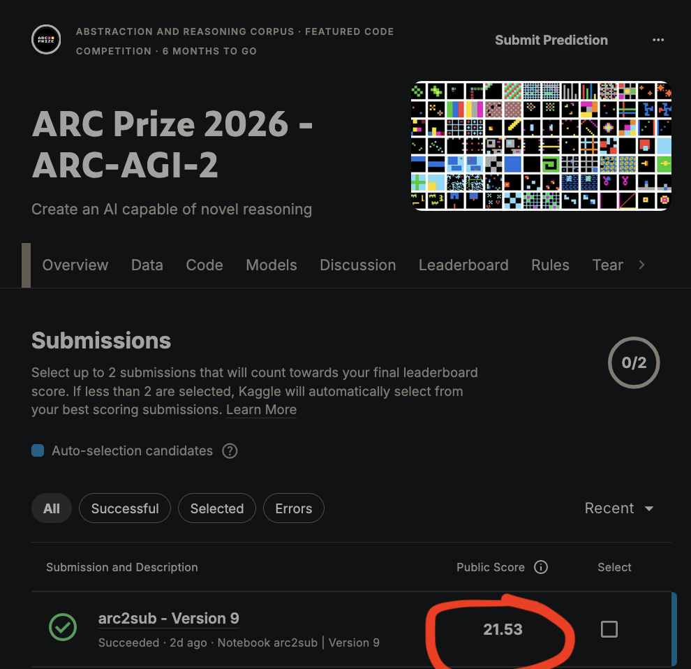

# Evidence of Exceptional Ability
## My work on ARC-AGI
### Public stuff
<!-- I started a year ago, and in 1 year.  -->
I built a tiny transformer that scores **44% on ARC-AGI**, trained from scratch in just **67 cents**.  

- This is the best non-LLM method in the world
- Also the cheapest, and trains the fastest by far (new pareto frontier)
- Beats *every single non-thinking LLM* and many thinking ones
- Least # of params at this performance
- Went viral on X, got the attention of top AI researchers (many thought the result to be impossible initially)

All the posts about my work on X: [https://x.com/evilmathkid/highlights](https://x.com/evilmathkid/highlights)  
More details in Blogs: [44% on ARC-AGI 1](https://mvakde.github.io/blog/44-on-arc-1), [A New Pareto Frontier on ARC-AGI](https://mvakde.github.io/blog/new-pareto-frontier-arc-agi).  
Code (open source): [https://github.com/mvakde/mdlARC](https://github.com/mvakde/mdlARC)

### Private stuff
Since then, I have doubled the score again and saturated ARC-1.  
Now working on v2 of the benchmark, currently at 21% (**beats GPT-5 Pro**).  
I expect to beat the WR (40%) in 2 weeks.  
Winner of v2 gets $425K (spoiler: its gonna be me)

<figure>
  
  <figcaption>Current verified ARC-2 score on private leaderboard on kaggle</figcaption>
</figure>

Why ARC? 
Its a famous metalearning benchmark. Easy for humans, hard for AI models, including LLMs. The benchmark’s been open since 2019 and despite a heavy cash prize, no substantial progress was made till thinking LLMs in 2024. I showed that vanilla transformers were good enough to make the same progress at OOMs less effort

## Achievements

- Invited to Team India selection & training camp (International Olympiad in Astronomy & Astrophysics)
- NIUS fellowship by Tata Institute of Fundamental research, 2021
- Top 25 in India - Indian National Astronomy Olympiad 2018
- Ranked 324 all India in KVPY. Got the fellowship twice in 2018 & 2019. 
- Ranked 1500 in JEE Advanced, out of 0.9 million starting candidates (I did this without studying much, while most others who qualified studied for years)
- Top 300 all India, National Standard Exam in Astronomy
- Runner up, IBM teen hackathon (I was in 9th grade, everyone else in 12th grade)

# Career deets
## Education
B.Tech @ IIT Bombay, 2023 
Majored in Engineering Physics

## Work Ex
### 1. Founding team, GetCrux (YC W24)
Led the project on automated insights for performance marketers. Was a backend dev and product manager on other projects.

### 2. Research Intern, University of Paris Saclay
Found a correlation b/w DNA content & light absorption while analysing UV images of viruses. Did a bunch of physics experiments on RNA/protein mixtures

### 3. Intern, New ventures arm @ Tata
Evaluated business models / industry research for Deeptech investments. Regularly presented to senior leadership of Tata Industries and other companies
